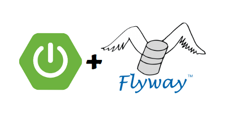

# Projeto BASE - Para Spring Boot com JPA e FlyWay

Neste projeto foram utilizadas as seguintes tecnologias:
- Spring Boot 3 para Java 17
- Open Api 3.0
- Flyway
- Lombok
- JPA
- Banco MySQL (contêiner)

Este é um projeto de aprendizado também pode ser utilizado como ponto de partida para outros projetos, ou mesmo a 
criação, de micro serviços. Este projeto contém transações para uma tabela Conta (Account), e os seguintes contratos API
foram disponibilizados:
- Criação de uma conta;
- Obter todas as contas;
- Obter uma determinada conta;
- Transação de crédito na conta;
- Transação de débito na conta; e
- Eliminação de uma determinada conta.



## Classe Record (Java 16)

1. Java Record é uma classe especial que auxilia no encapsulamento relacionado a dados sem a necessidade para "boilerplate" (são seções de código que é repetido em muitos lugares com um mínimo de variação, a solução era mover isso para uma Classe abstrata).
2. Classe Record é usado como solução DTO (Data Transfer Object) em aplicações Spring Boot como uma solução eficiente para o encapsulamento de transferência de dados entre as camadas.
3. Records são conscisos, imutáveis e automaticamente implementam métodos construtores, getter(), equals(), hashCode() e toString() que são essenciais para DTO. 

## Flyway

Neste projeto utilizamos o Flyway como uma solução para controle de mudanças das modificações em tabelas e dados.
Não deixaremos o JPA controlar as mudanças automáticas em tabelas, pois o Flyway é uma solução mais estável além de gerar logs dessas mudanças e possibilidade de retorno de estado.

## Execução

Primeiro é necessário construir um Contêiner com o Docker para o MySQL:
```
$ docker run --name meu-mysql -e MYSQL_ROOT_PASSWORD=root -p 3306:3306 -d mysql:8.1.0
```

A versão 8.1.0 é a versão recomendada pela Flyway, testar com: SELECT version();

Parar com:
```
$ docker stop meu-mysql
```

Nas próximas vezes, iniciar com: 
```
$ docker start meu-mysql
```

Com o contêiner ativo, criar o banco de dados através dos seguintes passos:

1. Entrar no contêiner:
```
$ docker exec -it meu-mysql bash
```
2. Acessar o mysql:
```
bash-4.4# mysql -uroot -p
```
3. Ao digitar a senha root, criar o banco de dados e sair do contêiner:
```
mysql> create database banking_app;
mysql> exit
bash-4.4# exit
```

## Documentação

A documentação é uma parte essencial da construção de APIs REST. Foi utilizada a SpringDoc, que simplifica a geração 
e manutenção de documentos de API com base na especificação OpenAPI 3 para aplicativos Spring Boot 3.x. Ao ativar o
projeto, a documentação pode ser acessada no endereço: http://localhost:8080/swagger-ui-custom.html.

O contrato, em formato JSON, está exposto no endereço: http://localhost:8080/api-docs.
